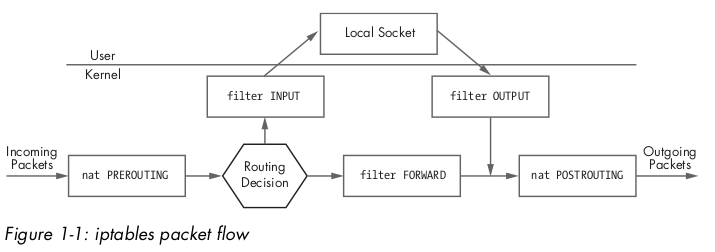
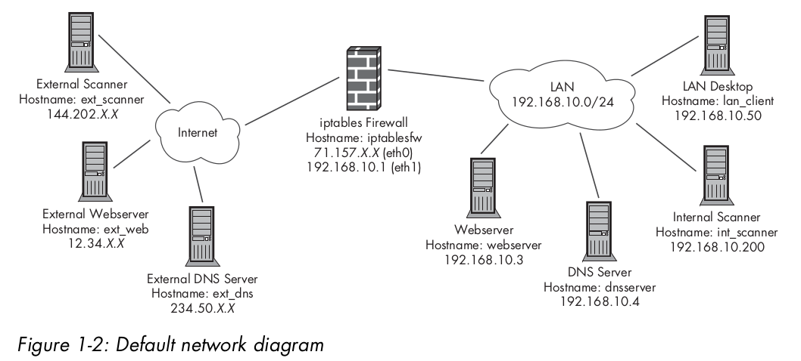

# 1 Care and feeding of iptables

This chapter covering essential aspects of properly installing, maintaining, and interacting with the iptables firewall on Linux systems. Also , aspects such as iptables administration from the perspectives of both kernel and userland, as well as how to build and maintain an iptables firewall policy. 

## 1.1 iptables

The iptables firewall is developed by Netfilter Project and has been available to the masses as part of Linux since the release of the Linux 2.4 kernel in January 2001.

The differences between the terms *iptables* and *Netfilter* have been a source of some confusion in the Linux community. To reduce the complexity, think them as follow:

 - Netfilter: providing the framework on which *iptables* builds firewall functionality.
 - iptables: refers to the userland tool that parses the command line and communicates a firewall policy to the kernel.

Terms such as *tables* , *chains* , *matches* , and *targets* make sense in the context of iptables.

Netfilter does not filter traffic itself--it just allows functions that *can* filter traffic to be hooked into the right spot within the kernel. The Netfilter Project also provides serveral pieces of infrastructure in the kernel, such as connection tracking and logging; any iptables policy can use these facilities to perform specialized packet processing.

## 1.2 Packet Filtering with iptables

An iptables policy is built from an ordered set of *rules* , which describe to the kernel the actions that should be taken against certain classes of packets. Each iptables rule is applied to a chain within a table.  **An iptables *chain* is a collection of rules that are compared , in order , against packets that share a common characteristic (such as being routed to the Linux system, as opposed to away from it.)**

### 1.2.1 Tables

A *table* is an iptables construct that delineates broad categories of functionality, such as packet filtering or Network Address Translation(NAT). There are four tables: **filter** , **nat** , **mangle** , and **raw** .

Filtering rules are applied to the filter table.

NAT rules are applied to the nat table.

Specialized rules that alter packet data are applied to the mangle table.

Rules that should function independently of the Netfilter connection-tracking subsystem are applied to the raw table.

### 1.2.2 Chains

Each table has its own set of built-in chains, but user-defined chains can also be created so that the user can build a set of rules that is related by a common tag such as **INPUT_ESTABLISHED** or **DMZ_NETWORK** . The most important built-in chains for our purposes are the **INPUT** , **OUTPUT** , and **FORWARD** chains in the filter table:

- The **INPUT** chain is traversed by packets that are **destined for the local Linux system after a routing calculation is made within the kernel(i.e., packets destined for a local socket)**.
- The **OUTPUT** chain is reserved for packets that are **generated by the Linux system itself**.
- The **FORWARD** chain governs packets that are **routed through the Linux system(i.e., when the iptables firewall is used to connect one network to another and packets between the two networks must flow through the firewall)**.

Two additional chains that are important for any serious iptables deployment are the **PREROUTING** and **POSTROUTING** chains in the nat table, which are **used to modify packet headers before and after an IP routing calculation is made within the kernel**.

Figure 1-1 shows how packets flow through the **nat** and **filter** tables within the kernel.



### 1.2.3 Matches

Every iptables rule has a set of matches along with a *target* that tells iptables what to do with a packet that conforms to the rule. **An iptables *match* is a condition that must be met by a packet in order for iptables to process the packet according to the action specified by the rule target**. 

Each match is specified on the iptables command line. The most import iptables matches for this book are listed below:

**--source (-s)** 					Match on a source IP address or network

**--destination (-d)**			Match on a destination IP address or network

**--protocol (-p)** 				

**--in-interface (-i)** 	Input interface

**--out-interface (-o)** 	Output interface

**--state** 				Match on a set of connection states

**--string** 				Match on a sequence of application layer data bytes

**--comment** 			Associate up to 256 bytes of comment data with a rule within kernel memory

### 1.2.4 Targets

Iptables supports a set of targets that trigger an action when a packet matches a rule. The most import targets used in this book are as follows:

**ACCEPT**			Allows a packet to continue on its way.

**DROP**			Drops a packet. No further processing is performed, and as far as the receiving 

​				stack is concerned, it is as though the packet was never sent.

**LOG**			Logs a packet to syslog

**REJECT**			Drops a packet and simultaneously sends an appropriate response packet (e.g., a

​				TCP Reset packet for a TCP connection or an ICMP Port Unreachable message for 

​				a UDP packet).

**RETURN**		Continues processing a packet within the calling chain.

## 1.3 Installing iptables

Because iptables is split into two fundamental components (kernel modules and the userland administration program), installing iptables involves compiling and installing both the Linux kernel and the userland binary.

Linux内核源码包含了Netfilter的许多子系统，基本的包过滤功能在一些内核发行版本中是默认开启的。

在内核2.6早期版本以及2.4版中，Netfilter编译选项默认是没有开启的。

虽然许多Linux发行版自带了编译好的iptables， 但从Linux内核官网下载的内核设置默认是没有开启的，所以并不是所有的Netfilter子系统都开启了。例如Netfilter connection-tracking功能直到内核的2.6.20.1版才默认开启。

在安装Linux内核前，需要下载并解压。对于2.6.20.1版本，可采用如下命令：

```bash
# 假定当前用户在/usr/src/目录下，且有相应权限
$ wget http://www.kernel.org/pub/linux/kernel/v2.6/linux-2.6.20.1.tar.bz2
$ tar xfj linux-2.6.20.1.tar.bz2
$ ls -ld linux-2.6.20.1
```

# 1.4 Kernel Configuration

在进行内核编译前，需要构建kernel configuration file。

```bash
$ cd /usr/src/linux-2.6.20.1
$ make menuconfig
```

The `make menuconfig` command launches the Ncurses interface in which you can select various compile options. The Ncurses interface also easily lends itself to the configuration of a remote Linux kernel across an SSH session without having to forward an X Windows connection.

执行make menuconfig命令后，选择Networking->Networking Options - > Network Packet Filtering Framework

### 1.4.1 Essential Netfilter Compilation Options

Some of the more important options to enable within the kernel configuration file include Netfilter connection tracking, logging, and packet filtering. There are two additional configuration sections in the Network Packet Filtering Framework section -- Core Netfilter configuration and IP:Netfilter Configuration.

### 1.4.2 Finishing the kernel Configuration

### 1.4.3 Loadable Kernel Modules vs. Built-in Compilation and Security

本部分涉及的Netfilter大部分的子系统可以通过以下集中方式编译进内核：

- Loadable Kernel Module(LKM): 在运行时，可以动态的加入或者移除内核
- compiled directly into kernel:直接编译进内核，这意味着不能在运行时进行加载或移除模块

There is a **security trade-off between compiling functionality as an LKM and compiling directly into the kernel**. 一方面以LKM方式加入内核的任何特性的模块都可以通过`rmmod`命令将其从运行中的内核中移除。对于后期发现模块存在安全漏洞的场景，LKM方式更有优势。因为有些情况下漏洞是可以通过加载模块的方式缓解。并且，如果内核源码已经对漏洞进行了不定，则模块可以重新编译和部署甚至于在不停机的情况下完成，漏洞的修复可以实现zero downtime.

另一方面，如果被发现的漏洞代码已经直接编译到内核，漏洞修复的唯一方法是打补丁，重新编译，接着重启系统，但对于任务苛刻的系统(如集团级DNS服务器)，这种直接编译进内核的方式可能就不够灵活了。

以可加载的方式编译内核有潜在危险的可能。如果攻击者能成功的修改系统，就可能通过加载内核的方式植入内核级木马。这可能导致文件系统一致性检查工具崩溃，进程可以被隐藏，网络连接可以躲避`netstat` `lsof` 等工具的检查。Simply compiling the kernel without module support is not a foolproof solution, however, since not all kernel-level rootkits require the host kernel to offer module support. For example, the SucKIT rootkit can load itself into a running kernel by directly manipulating kernel memory through the `/dev/kmem` character device.

## 1.5 Security and Minimal Compilation

不管采用哪种编译Netfilter子系统的策略——LKM方式或直接编译进内核方式——在计算机安全中一个不可推翻的事实就是，系统越复杂，越不安全。越复杂的系统，越难做到安全。幸运的是iptables在运行时阶段和编译功能特性阶段都提供了极高的可配置性。

为了减小内核运行时代码的福再度，不需要的特性不要编译进内核。从内核移除不需要的代码可以最小化未发现漏洞的存在的可能性。比如，如果不需要logging support，simply do not enable the Log Target Support option in the menuconfig interface. 如果不需要跟踪FTP的连接状态，则不要启用FTP Protocol 选项。

## 1.6 Kernel Compilation and Installation

To compile and install the new 2.6.20.1 kernel within the `/boot` partition, execute the following commands:

```bash
$ make
$ su -
Password:
# mount /boot
# cd /usr/src/linux-2.6.20.1
# nake install && make modules_install
```

Assuming that you are using the **GRUB** bootloader and thatthe mount point for the root partition is `/dev/hda2` , add the following lines to the `/boot/grub/grub.conf` file using your favorite editor:

```bash
title linux-2.6.20.1
root (hd0,0)
kernel /boot/vmlinuz-2.6.20.1 root=/dev/hda2
```

Now, reboot!

```bash
# shutdown -r now
```

## 1.7 Installing the iptables Useland Binaries

在启动进入新的内核后，接下来安装新的iptables命令。首先要下载并解压iptables源码，并检查MD5：

```bash
$ cd /usr/local/src/
$ wget http://www.netfilter.org/projects/iptables/files/iptables-1.3.7.tar.bz2
$ md5sum iptables-1.3.7.tar.bz2
$ tar xfj iptables-1.3.7.tar.bz2
$ cd iptables-1.3.7
```

编译iptables需要读取内核源代码，因为编译需要C的头文件，而这些头文件分布在如/linux/netfilter_ipv4中的内核源代码中。这里使用/usr/src/linux-2.6.20.1目录在命令行中定义**KERNEL_DIR** 变量，变量**BINDIR**和**LIBDIR** 定义了iptables二进制文件和库文件的安装路径，命令如下:

```bash
$ make KERNEL_DIR=/usr/src/linux-2.6.20.1 BINDIR=/sbin LIBDIR=/lib
$ su -
Password:
# cd /usr/local/src/iptables-1.3.7
# make install KERNEL_DIR=/usr/src/linux-2.6.20.1 BINDIR=/sbin LIBDIR=/lib
```

验证安装结果:

```bash
# which iptables
/sbin/iptables
# iptables -V
iptables v1.3.7
# iptables -nL
```

## 1.8 Default iptables Policy

有了iptables之后，接下来就是各种管理和配置iptables防火墙

### 1.8.1 Policy Requirements

Assuming our configuration firewall for a network consisting of several client machines and two servers. The servers (a webserver and a DNS server) must be accessible from the external network. Systems on the internal network should be allowed to initiate the following types of traffic through the firewall to external servers:

- Domain Name System(DNS) queties
- File Transfer Protocol(FTP) transfers
- Network Time Protocol (NTP) queries
- Secure Shell (SSH) sessions
- Simple Mail Transfer Protocol(SMTP) sessions
- Web session over HTTP/HTTPS
- whois queries

除了上面列出来的服务，其他的网络包都需要阻挡。Sessions initiated from the internal network or directly from the firewall should be statefully tracked by iptables (with packets that do not conform to a valid state logged and dropped as early as possible), and NAT services should also be provided.

此外，防火墙还应该能控制来自于内部网络需要转发到其他外网IP地址的欺骗数据包:

- The firewall itself must be accessible via SSH from the internal network. but from nowhere else unless it is running fwknop(detail in chapter 13) for authentication . SSH should be the only server process running on the firewall.
- The firewall should accept ICMP Echo Requests from both the internal and external networks, but unsolicited ICMP packets that are not Echo Requests should be dropped from any source IP address.
- Lastly, the firewall should be configured with a default *log and drop stance* so that any stray packets, port scans , or other connection attempts that are not explicitly allowed through will logged and dropped.

> NOTE: We will assume that external IP address on the firewall is statically assigned by the ISP, but a dynamically assigned IP address would also work because we restrict packets on the external network by interface name on the firewall instead of by IP address.

为了简化构建iptables策略的任务，假定只有一个没有路由的内网网段192.168.10.0，C类网段，子网为255.255.255.0(or /24 in CIDR notation)

防火墙连接内网的网卡为eth1, ip地址为192.168.10.1 并且内网的所有主机都以这个地址作为其默认网管。**This allows internal systems to route all packets destined for systems that are not within the 192.168.10.0/24 subnet out through the firewall** . 这使得内网系统路由目的地址为非192.168.10.0/24子网的数据包通过防火墙。防火墙的外网网卡是eth0，给配其IP地址为71.157.X.X。如下图：



上面的网络图中有两个恶意的(malicious)系统：一个在内网(192.168.10.200, hostname int_scanner);另一个在外网(144.202.X.X , hostname ext_scanner).

### 1.8.2 iptables.sh Script Preamble

开始编写iptables.sh脚本之前，定义三个变量，**IPTABLES**  and **MODPROBE** (for the paths to the iptables and modprobe binaries) and **INT_NET** (for the internal subnet address and mask). 内核中运行的任何存在的iptables规则都要移除，并且filtering policy设置为DROP在INPUT, OUTPUT, FORWARD链中。

```bash
#!/bin/sh

### define three variables
IPTABLES=/sbin/iptables
MODPROBE=/sbin/modprobe
INT_NET=192.168.10.0/24

### flush existing rules and set chain policy setting to DROP
echo "[+] Flushing existing iptables rules..."
### removing existing iptables rules from running kernel
$IPTABLES -F
$IPTABLES -F -t nat
$iptables -X
$IPTABLES -P INPUT DROP
$IPTABLES -P OUTPUT DROP
$IPTABLES -P FORWARD DROP
### load connection-tracking modules
$MODPROBE ip_conntrack
$MODPROBE iptable_nat
$MODPROBE ip_conntrack_ftp
$MODPROBE ip_nat_ftp
```

### 1.8.3 The INPUT Chain

The **INPUT** chain is the iptables construct that governs whether packets that are **destined for the local system (that is , after the result of a routing calculation made by the kernel IP stack designates that the packet is destined for a local IP address) may talk to a local socket** . 如果INPUT链的第一条规则是丢弃所有的包(或INPUT的policy设置为DROP)，则所有直接基于IP与系统的通信(如TCP UDP ICMP)都会失败。

The *Address Resolution Protocol(ARP)* is also important class of traffic that is ubiquitous on Ethernet networks. However, because ARP works at the data link layer instead of the network layer, iptables cannot filter such traffic, since it only filter IP traffic and overlying protocols.

Hence, ARP requests and replies are sent and received regardless of the iptables policy. (ARP协议的数据包过滤使用arptables, 但是这个话题超出了本书的范围，本书基本上关注与网络层以上的数据包)

> NOTE: iptables 可以基于数据链路层的MAC地址过滤IP包，但是只有在Kernel启用了MAC address extention时才可以。2.4版的内核必须手动启动，2.6版的内核默认是启用的。

继续iptables.sh脚本，下面是INPUT链的规则：

```bash

```

