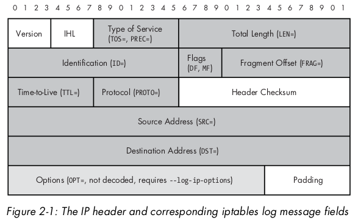
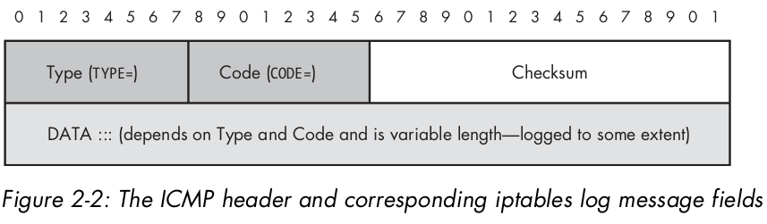

# 2 Network Layer Attacks  and Defense

This book is concerned mostly with attacks that are delivered over IPv4 networking protocol, though many other networking protocols also exist, such as IPX, X.25 , and the latent IPv6 protocol.

In this chapter, we'll focus first on **how iptables logs network layer packet header within log message output **. Then we'll see **how these logs can be used to catch suspicious network layer activity** .

## 2.1 Logging Network Layer Headers with Iptables

With the iptables LOG target, firewalls built with iptables have the ability to write log data to syslog for nearly every field of the IPv4 headers. Because the iptables logging format is quite thorough , **iptables logs are well-suited to supporting the detection of many network layer header abuses**.

### 2.1.1 Logging the IP Header

The IP header is defined by RFC 791, which describes the structure of the header used by IP. RFC 791定义了IP头部，IP头部描述了IP协议使用的头部结构。图2-1展示了IP头部的结构，阴影部分是iptables在日志消息中包含的信息。在日志信息中，iptables使用标识字符串来标记阴影中每个字段名称。如Total Length 字段使用**LEN=**为前缀的字符串，后面跟着实际total lenght的值。



上图中，深色阴影的字段都会被iptables记录到日志中；没有阴影的字段基本不会被输出到日志。对于浅色阴影的字段，ip头部的options信息只有在iptables使用了命令行参数`--log-ip-options` 且LOG规则添加到iptables策略中时才会记录到日志中。

下面是iptables记录日志信息的例子：

```bash
[ext_scanner]$ ping -c 1 71.157.X.X
PING 71.157.X.X (71.157.X.X) 56(84) bytes of data.
64 bytes from 71.157.X.X: icmp_seq=1 ttl=64 time=0.171 ms
--- 71.157.X.X ping statistics ---
1 packets transmitted, 1 received, 0% packet loss, time 0ms
rtt min/avg/max/mdev = 0.171/0.171/0.171/0.000 ms
[iptablesfw]# tail /var/log/messages | grep ICMP | tail -n 1
Jul 22 15:01:25 iptablesfw kernel: IN=eth0 OUT=
MAC=00:13:d3:38:b6:e4:00:30:48:80:4e:37:08:00 SRC=144.202.X.X DST=71.157.X.X
LEN=84 TOS=0x00 PREC=0x00 TTL=64 ID=0 DF PROTO=ICMP TYPE=8 CODE=0 ID=44366 SEQ=1
```

日志中记录的IP头部的信息开始于源IP地址。其他首部信息如目标IP地址，TTL值，协议等字段以黑体方式呈现。

The Type Of Service field (TOS), and the precedence and corre-
sponding type bits are included as separate hexadecimal values to the TOS
and PREC fields. **The Flags header field in this case is included as the string DF ,
or Don't Fragment , which indicates that IP gateways are not permitted to split the packet into smaller chunks**. Finally, the PROTO field is the protocol encapsulated
by the IP header—ICMP in this case. The remaining fields in the log message
above include the **ICMP TYPE , CODE , ID , and SEQ values in the ICMP Echo
Request packet sent by the ping command**, and are **not part of the IP header**.

### 2.1.2 Logging IP Options

IP options 给IP通信提供了多种控制函数，包括timestamps, certain security capabilities, and provisions for special routing features。IP options的字节长度是不固定的，且在互联网上很少使用。如果没有IP options，一个IP包的头部长度占20个字节。要想日志中记录IP options，需要iptables LOG规则中使用`--log-ip-options`参数：

```bash
[iptablesfw]# iptables -A INPUT -j LOG --log-ip-options
```

接下展示iptables记录IP options日志，继续使用`ping`命令， 但是设定`timestamp`选项为`tsonly`(only timestamp):

```bash
[ext_scanner]$ ping -c 1 -T tsonly 71.157.X.X
PING 71.157.X.X (71.157.X.X) 56(124) bytes of data.
64 bytes from 71.157.X.X icmp_seq=1 ttl=64 time=0.211 ms
TS:		68579524 absolute
		578
		0
		-578
--- 71.157.X.X ping statistics ---
1 packets transmitted, 1 received, 0% packet loss, time 0ms
rtt min/avg/max/mdev = 0.211/0.211/0.211/0.000 ms
[iptablesfw]# tail /var/log/messages | grep ICMP
Jul 22 15:03:00 iptablesfw kernel: IN=eth0 OUT=
MAC=00:13:d3:38:b6:e4:00:30:48:80:4e:37:08:00 SRC=144.202.X.X DST=71.157.X.X
LEN=124 TOS=0x00 PREC=0x00 TTL=64 ID=0 DF OPT (44280D00041670C404167306000000
00000000000000000000000000000000000000000000000000) PROTO=ICMP TYPE=8 CODE=0
ID=57678 SEQ=1
```

OPT后面是一个十六进制的字节序列，这个字节序列包含了IP头部中IP options的全部信息。但是iptables的LOG target并没有解码。具体在第7章介绍。

### 2.1.3 Logging ICMP

因为ICMP也属于网络层，因此iptables的LOG target可以记录ICMP日志。 RFC 792定义了ICMP头部为32 bits. 如下图所示：



与IP头部一样，LOG target只会记录type和code字段，不会记录`Checksum`字段，没有参数开启后可以记录`DATA`字段，日志示例如下：

```bash
Jul 22 15:01:25 iptablesfw kernel: IN=eth0 OUT=
MAC=00:13:d3:38:b6:e4:00:30:48:80:4e:37:08:00 SRC=144.202.X.X DST=71.157.X.X
LEN=84 TOS=0x00 PREC=0x00 TTL=64 ID=0 DF PROTO=ICMP
TYPE=8 CODE=0 ID=44366 SEQ=1
```

## 2.2 Network Layer Attack Definitions

网络层攻击定义为：通过对网络层数据包头部的字段进行滥用，来利用末端主机网络协议栈实现的漏洞，达到耗费网络层资源或掩盖(屏蔽)更高层协议数据包的分发。

网络层攻击可以分为以下三类：

- **Header abuses**  Packets that contain maliciously(恶意) constructed , broken, or falsified(篡改) network layer headers, Examples include IP packets with spoofed source addresses and packets that contain unrealistic fragment offset values.
- **Network stack exploits**  数据包包含特殊结构的组成部分，用来利用终端主机网络协议栈实现上的漏洞。A good example is the IGMP Denial of Service(Dos) vulnerability discovered in the Linux kernel(version 2.6.9 and earlier)
- **Bandwidth saturation  ** 数据包在目标网络上占据了所有带宽。A Distributed Denial of Service(DDoS) attack sent over ICMP is a good example

## 2.3 Abusing the Network Layer

网络层的功能是将数据包路由到目的地址。因为IPv4没有任何的授权概念(授权留给了IPSec协议或更高层的机制)， 所以攻击者很容易通过操纵头部或数据来构造IP包。但这样的数据包有可能被在线过滤设备如防火墙或带ACL的路由器过滤，在数据包到达目标之前。

### 2.3.1 Nmap ICMP Ping

**Host discovery is performed by sending an ICMP Echo Request and a TCP ACK to port 80 on the targeted hosts. (Host discovery can be disabled with the Nmap -P0 command-line argument but it is enabled by default)**

Nmap产生的ICMP Echo Requests数据包与ping命令产生的不同，因为它的ICMP头部不包含任何数据。因此这样的数据包的IP length filed应是28字节：20 bytes for the IP header without options, plus 8 bytes for the ICMP header , plus 0 bytes for data.

```bash
[ext_scanner]# nmap -sP 71.157.X.X
[iptablesfw]# tail /var/log/messages | grep ICMP
Jul 24 22:29:59 iptablesfw kernel: IN=eth0 OUT=
MAC=00:13:d3:38:b6:e4:00:30:48:80:4e:37:08:00 SRC=144.202.X.X DST=71.157.X.X
LEN=28 TOS=0x00 PREC=0x00 TTL=48 ID=1739 PROTO=ICMP TYPE=8 CODE=0 ID=15854
SEQ=62292
```

> NOTE:ping 命令也是可以产生没有应用层数据的数据包的，通过在命令行参数中使用      `-s 0` 来设置一个0长度的payload data。默认情况下ping命令会包含几十字节的payload data.

没有应用层数据并不一定是abuse of network layer。如果你发现这样的数据包结合其他的数据包显示了有端口扫描的活动，这说明有人在使用Nmap对你的网络进行探测。

### 2.3.2 IP Spoofing

计算机安全领域有几个属于非常容易让人混淆。spoof是愚弄，恶作剧。而IP spoofing是故意构造虚假源地址的IP包。

> NOTE:我们需要排除一个例外，就是NAT对IP包原地址的更改操作。这种不能与IP spoofing混淆， NAT是合法的网络功能，而隐藏虚假的源地址的攻击就不是了。

说道基于IP协议的通信时，其内置地址进行限制的功能。通过使用原生的socket(比较底层的编程API) , IP 包可以用任意的源地址进行发送。如果源地址在当前局域网环境中是没有意义的(比如数据包的源地址IP属于Verizon's 网络，而数据要实际上是要从Comcast's网络发出)，那么则认为此数据包是spoofied。管理员可以采取措施设置路由和防火墙来拒绝转发源地址不属于内网范围内的数据包(这样spoofed数据包永远不会出去),但很多网络并没有限制这样的行为。

从安全的角度将，关于spoofed packets最重要的事情是不要相信源地址。实际上，一次成功的攻击可以是单个spoofed packet转发造成的。(detail in chapter 08)

> NOTE: 需要注意的是，任何从目标地址返回的数据包都会被返回给虚假IP源地址。令人欣慰的是，任何基于需要双向数据交互的协议，如传输层的TCP协议，都不会对虚假IP源地址敏感。

许多安全软件(both offensive and defensive)都有制造虚假源IP地址的功能。DDoS工具将制造虚假IP源地址作为最基本的工具，比较著名的工具如`hping`和`Nmap`都能够制造虚假IP源地址。

### 2.3.3 IP Fragmentation

将IP数据包分割成一系列较小的数据包是IP协议的基本特性。**The process of splitting IP packets, known as *fragmentation*, is necessary when an IP packet is routed to a network where the data link MTU size  is too small to accommodate the packet**. It is responsibility of any router that connects two data link layers with different MTU sizes to ensure that IP packets transmitted from one data link layer to another never execcd the MTU. 连接两个不同MTU的数据链路层的路由器负责传输的数据包不超过任何MTU值。**The IP stack of the destination host reassembles the IP fragments in order to create the original packet, at which point an encapsulated protocol with in the packets is handed up the stack to the next layer**.

IP fragmentation 可以被攻击者用做IDS(Intrusion Detection Systems入侵检测系统)躲避机制。将用于攻击的数据包可以分割成多个IP fragments. 最终接受的IP stack实现者会完全组装fragments。但是为了检测攻击，IDS也会采用最终组装fragments的IP stack相同的算法来组装数据包。因为IP stack实现组装的算法有些不同(如，for duplicate fragments, Cisco IOS IP stacks reassemble traffic according to a last fragment policy, where as Windows XP stacks reassemble according to a first fragment policy),这对IDS来说是个挑战。The gold standard for generating fragmented traffic is Dug Song’s fragroute tool (see http://www.monkey.org)

### 2.3.4 Low TTL Values

IP数据包中IP头部的TTL值每经过一次IP路由器，转发到下一个系统都会减1. 如果你的本地子网中出现了TTL为1 的数据包，那可能是有人在使用traceroute程序(或者类似tcptraceroute工具)追踪一个IP地址，此IP地址可能是存在于本地子网，也可能是被路由经过本地子网。通常有人也会使用此方法排查网络连通性问题，但也可能是有人在对你的网络进行探测，以发现潜在可路由到的目标地址。

> NOTE: Packets destined for multicast addresses(all addresses with the range 224.0.0.0 through 239.255.255.255, as defined by RFC 1112)commonly have TTL values set to one. So if the destination address is a multicast address, it is likely that such traffic is not associated with network mapping efforts with traceroute and is just legitimate multicast traffic.

traceroute 产生的UDP数据包在iptables中会产生如下日志：

```bash
Jul 24 01:10:55 iptablesfw kernel: DROP IN=eth0 OUT=
MAC=00:13:d3:38:b6:e4:00:13:46:c2:60:44:08:00 SRC=144.202.X.X DST=71.157.X.X
LEN=40 TOS=0x00 PREC=0x00 TTL=1 ID=44081 PROTO=UDP SPT=54522 DPT=33438 LEN=20
```

### 2.3.5 The Smurf Attack

The smurf attack is an old but elegant technique whereby an attacker spoofs ICMP Echo Requests to a network broadcast address. 

The smurf attack is outdated when compared to tools that perform DDos attacks with dedicated control channels and for wich there is no easy router configuration countermeasure . Still , ti is worth mentioning , because the Smurf attack is so easy to perform and the original source code is readily available.

see http://www.phreak.org/archives/exploits/denial/smurf.c

### 2.3.6 DDoS Attacks

